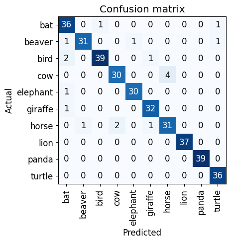

# Data Leakage

There is an issue in machine learning called data leakage.

Data leakage occurs when images from the training data set appear inside the test set. In a succesfully trained model this issue will cause issues where the success rate of the model is overtated by data that it has already classified.

In order to best avoid this images should be used that were not in the training and validation step done with fastai

```python
learn = vision_learner(dls, resnet18, metrics=error_rate)
learn.fine_tune(3)

```
For this additional dataset it is best to not scrape the internet as this will have data leakage from the same images accidentally being considered. therefore, before the learner is run a chunk of the images should be siphoned off as an isolated test data set for later.

Without doing this however, the below confusion matrix was generated:



This matrix identifies the actual catagory versus the detected catagory.
The matrix uses the default learner which has data leakage images.

Some interesting points to note are bats and birds getting confused, this is likely because they are both winged animals.
Additional points of interest are horses and cows, since these are both farm animals there are likely to be images that contain
both which would confuse the AI model.

